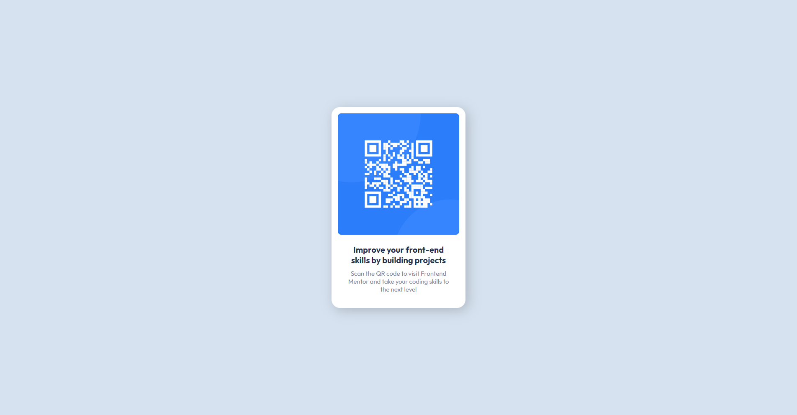

<h1 align="center">Front Mentor - QR Code Component Solution</h1>

This is a solution to the <a href="https://www.frontendmentor.io/challenges/qr-code-component-iux_sIO_H">QR code component challenge</a>on Frontend Mentor challenges help you improve your coding skills by building realistic projects. 

<h2 align="center">Desktop Version
  

    
  

</h2>