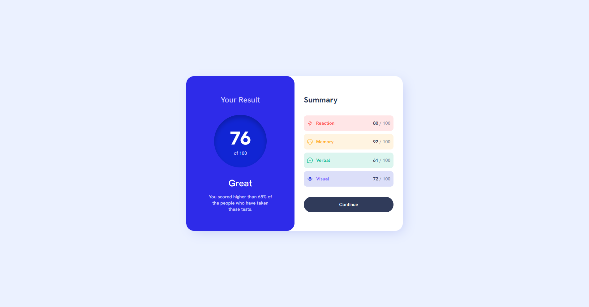
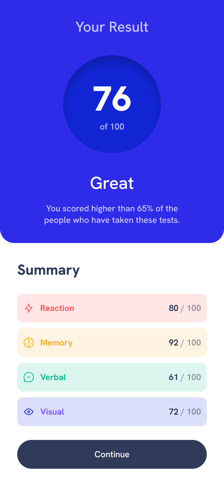

# Frontend Mentor - Results Summary Component Solution

This is a solution to the [Results summary component challenge on Frontend Mentor](https://www.frontendmentor.io/challenges/results-summary-component-CE_K6s0maV). Frontend Mentor challenges help you improve your coding skills by building realistic projects. 

<h1 align="center">Screenshots</h1>

<h2 align="center">Desktop Version
  

    
  

</h2>

<h2 align="center">Mobile Version
  

    
  

</h2>
